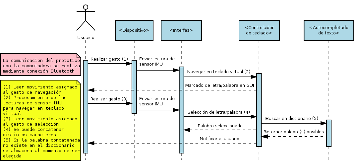

# COMPUTER WRITING FOR AMPUTEES
Repositorio para el control de versiones del prototipo de mi tesis de nivel maestría. Está conformado por los siguientes directorios:
* <strong>Hardware</strong>
    * <strong>Esquemas</strong>: Contiene los ficheros de los esquemáticos y prototipos del mecanismo de interacció
    * <strong>Renders_Exports</strong>: Contiene los ficheros exportados de los esquemas en formato .png y .pdf
    * <strong>Sketchs</strong>: Contiene los sketchs creados en Arduino IDE de las pruebas de los módulos de obtención de los datos desde el sensor IMU (imu_test_mpu6050, imu_test_mpu9250) y la comunicación bluetooth con el dispositivo HC-05 (bluetooth_test), además, contiene un sketch específico para la configuración del HC-05, mismo que ha sido probado con un microcontrolador Arduino Leonardo rev 2.0 (CMB-HC-05). Por último, este repositorio contiene el proyecto completo de la unificación de los módulos de obtención de datos y comunicación bluetooth (CWFA).
    * <strong>Resources</strong>: Contiene los recursos (librerias) necesarios para el desarrollo de los esquemas y sketches de Arduino.
* <strong>Software</strong>
    * Resources: 
* <strong>Resources</strong>: Contiene los recursos necesarios para la creación de este fichero README.md

## Problemática
La accesibilidad para usuarios con amputación parcial de miembro superior resulta compleja cuando se trata de la tarea de escritura de texto por computadora usando los mecanismos tradicionales. En un reporte del 2019, el INEGI menciona que los méxicanos entre 15 y 29 años hacen uso de la computadora para realizar sus actividades académicas, principalmente en niveles de educación superior, sin embargo, otro reporte realizado por la CNDH en 2019 menciona que el nivel superior es el más desatendido con respecto a la accesibilidad, lo que implica que los estudiantes con algún tipo de discapacidad no pueden ejercer su derecho a la educación al igual que estudiantes sin algún tipo de discapacidad. En promedio, una persona entre 15 y 30 años sin ninguna experiencia en mecanografía escribe 36 palabras por minuto usando un teclado tradicional, en cambio, las personas con discapacidad motriz haciendo uso de mecanismos alternativos de entrada de texto en promedio escriben entre 2.6 y 5.6 palabras por minuto, siendo una gran diferencia para realizar actividades académicas relacionadas con la escritura por computadora. 

La interacción humano-computadora es un área de la informática encargada de medir la usabilidad y la experiencia de usuario de un software, la ergonomía de un hardware y evalúa la satisfacción del usuario con respecto al uso de estos. Considerando esto, se sabe que las técnicas de interacción más comunes son las basadas en gestos, en seguimiento de la mirada, en reconocimiento de voz y mediante dispositivos móviles. Por otro lado, las tecnologías más comunes son los micrófonos, las cámaras web, los eyetrackers, los brazaletes MYO, sensores electromiográficos (EMG) e inerciales (IMU) y la fusión de sensores. Con respecto al apoyo de la interacción humano-computadora para personas con algún tipo de discapacidad motriz, se sabe que las técnicas más utilizadas son las  basadas en gestos y el seguimiento de la mirada, ya que implican la detección de movimientos naturales de cualquier parte del cuerpo y las tecnologías más comunes son el uso de cámaras web, sensores EMG, IMU y la fusión de estos.

Considerando que la tarea de escritura por computadora para personas con amputación de miembro superior se lleva a cabo dentro de un salón de clases, se sabe que la técnica de interacción basada en el reconocimiento de voz no es la adecuada debido a que las personas que comparten el contexto del usuario pueden contaminar las entradas. Por otro lado, el uso de la técnica de interacción basada en el seguimiento de la mirada tampoco es el adecuado dentro del contexto planteado ya que se puede generar el problema del "toque del rey Midas", el cual consiste en realizar la interacción de manera involuntaria, y de igual manera, la entrada puede ser contaminada por el contexto de uso.

Para esto, la técnica de interacción basada en gestos en combinación con la tecnología de sensores resulta ser la adecuada ya que es posible generar gestos específicos que pueden ser clasificados para generar algún tipo de respuesta dentro de la computadora y presentarlo al usuario. Se han realizado experimentos para la interacción de personas con algún tipo de dispacidad, en gran parte la manipulación del ratón, caso contrario para la escritura por computadora, sin embargo, los avances de los últimos años han demostrado que esta técnica, en conjunto con los gestos detectados mediante sensores y el uso de teclados virtuales específicos para la manipulación de mecanismos alternativos, permite realizar la tarea de escritura.

Por otro lado, no existe un modelo de interacción establecido para llevar a cabo la tarea de escritura por computadora de personas con amputación de miembro superior usando un mecanismo alternativo de entrada. Cada propuesta hace uso de sus propios mecanismos de interacción obteniendo resultados prometedores, sin embargo, la necesidad de establecer un modelo de interacción surge para la realización de nuevas propuestas que sigan un patrón de interacción capáz de ser abstracto, comprensible y replicable mediante distintas técnicas y tecnologías.

En conclusión, resulta adecuado la creación de un modelo de interacción para la tarea de escritura por computadora de personas con amputación de miembro superior, mismo que debe ser evaluado mediante un mecanismo que cubra las necesidades de uso dentro de un contexto de uso dentro de un salón de clases. Por lo tanto, esté proyecto presenta la propuesta de un modelo de interacción para este caso específico de la tarea y los usuarios objetivo.

## Modelo de interacción
El modelo de interacción para escritura de texto de personas con amputación de miembro superior propuesto busca establecer el desarrollo de mecanismos alternativos para la escritura de texto por computadora y mejorar la cantidad de palabras por minuto escritas usando este mecanismo
se presenta mediante un diagrama de secuencias donde, el usuario interactua con los objetos dispositivo, interfaz, controlador de teclado y autocompletado de texto. Como se observa en el diagrama, la técnica de interacción para el contexto de uso es la basada en gestos y la tecnología utilizada es el sensor IMU para este caso de estudio específico, sin embargo, la técnica y la tecnología puede ser cambiada para efecto de validación del modelo de interacción. 

## Prototipo
### Hardware

### Software

#### Universidad
    Universidad Veracruzana
    Facultad de Estadística e Informática
    Maestría en Sistemas Interactivos Centrados en el Usuario
    Xalapa, Ver., México

#### Autor
    Epsom Enrique Segura Jaramillo
    zS18016334@estudiantes.uv.mx
    segurajaramilloepsom@gmail.com

#### Directores
    MCC Juan Carlos Pérez Arriaga
    MCC Gerardo Contreras Vega